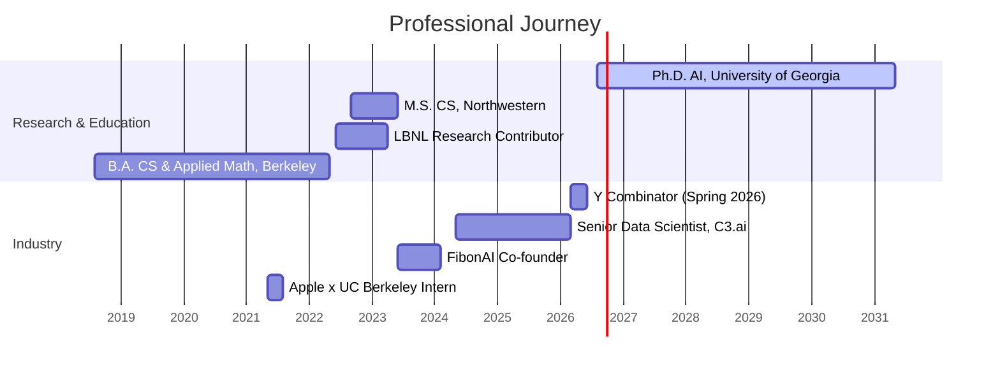

<div align="center">

# 👋 Hey, I'm Abel Yagubyan

### Ph.D. Student in AI @ University of Georgia | Trustworthy AI Evaluation | Y Combinator S26

[](https://abelo9996.github.io)
[](https://scholar.google.com/citations?user=rgd3iYwAAAAJ&hl=en)
[](https://orcid.org/0009-0004-8213-2863)
[](https://linkedin.com/in/abelyagubyan)
[](mailto:abelyagubyan@gmail.com)

</div>

---

## 🚀 About Me

```python
class AbelYagubyan:
    def __init__(self):
        self.current_role = "Ph.D. Student in Artificial Intelligence @ University of Georgia"
        self.building = "LearnOS, an open-source agentic AI university"
        self.location = "San Francisco, CA"
        self.education = {
            "phd": "Ph.D. Artificial Intelligence @ University of Georgia (2026 - present)",
            "masters": "M.S. Computer Science @ Northwestern (Summa Cum Laude)",
            "bachelors": "B.A. Computer Science & Applied Math @ UC Berkeley",
        }
        self.research = [
            "LLM-as-a-judge reliability",
            "LLM agent reproducibility",
            "Evaluation science",
            "Open-source LLM evaluation tooling",
        ]

    def achievements(self):
        return {
            "accelerator": "Y Combinator, Spring 2026 batch",
            "papers": "4 published (GroundLM @ EMNLP 2026, MNRAS 2022, ACM SIGCSE 2022)",
            "citations": "27, incl. Meta Superintelligence Labs and Alibaba",
            "peer_review": "194 reviews across 9 Elsevier AI journals",
            "open_source": "Area Triager @ TruLens (Snowflake), contributor @ UK AISI inspect_evals",
            "industry": "Senior Data Scientist @ C3.ai, Co-founder @ FibonAI (Berkeley SkyDeck)",
        }
```

---

## 📄 Research & Publications

| Year | Paper | Venue | Cited by |
|:---:|---|---|:---:|
| 2026 | [**The Coin Flip Judge? Reliability and Bias in LLM-as-a-Judge Evaluation**](https://arxiv.org/abs/2606.13685) (sole author) | GroundLM 2026 @ EMNLP 2026, Archival Long Paper | 4 (incl. [Meta Superintelligence Labs](https://arxiv.org/abs/2608.08775)) |
| 2026 | [**How Consistent Are LLM Agents? Measuring Behavioral Reproducibility in Multi-Step Tool-Calling Pipelines**](https://arxiv.org/abs/2605.28840) (sole author) | arXiv preprint | 4 (incl. [Alibaba](https://arxiv.org/abs/2608.09290)) |
| 2022 | [**The Lick Observatory Supernova Search follow-up program: photometry data release of 70 SESNe**](https://doi.org/10.1093/mnras/stac723) (Zheng, Stahl, Filippenko, et al.) | MNRAS, vol. 512 | 19 |
| 2022 | **Embedding of Programming IDEs into Computer-Based Testing Software** (Yagubyan, Garcia) | ACM SIGCSE '22 | 0 |

**Peer review:** 194 verified reviews across nine Elsevier journals, including *Engineering Applications of Artificial Intelligence*, *Image and Vision Computing*, *Neural Networks*, and *Information Fusion*. See my [ORCID record](https://orcid.org/0009-0004-8213-2863).

---

## 🧩 Open Source

| Project | Role | What |
|---|---|---|
| [**LearnOS**](https://github.com/Abelo9996/LearnOS) | Creator & Maintainer | Self-hosted, open-source "AI university": specialized agents (curriculum, Socratic tutor, assessment, research, analytics) that build personalized roadmaps, teach in real time, and grade toward mastery. One OpenRouter key, any model, no accounts. MIT. |
| [**TruLens**](https://github.com/truera/trulens) (Snowflake) | Area Triager, listed in [MAINTAINERS.md](https://github.com/truera/trulens/blob/main/MAINTAINERS.md) | [13 merged PRs](https://github.com/truera/trulens/pulls?q=is%3Apr+author%3AAbelo9996+is%3Amerged): OpenTelemetry streaming metrics (TTFT, throughput) and correctness fixes across the database layer, evaluation API, providers, and dashboard. |
| [**inspect_evals**](https://github.com/UKGovernmentBEIS/inspect_evals) (UK AI Security Institute) | Contributor | Migrated shared metric helpers to the framework's aggregation API; credited in [release v0.20.0](https://github.com/UKGovernmentBEIS/inspect_evals/releases/tag/v0.20.0). |

---

## 🔬 Featured Projects

<div align="center">

### 🎓 [LearnOS](https://github.com/Abelo9996/LearnOS)
> Open-source, agentic **AI university** with personalized roadmaps, real-time tutoring, and mastery-based grading  
> `JavaScript` `Node.js` `Vite` `SQLite` `OpenRouter`

### 🏗️ [Synthora](https://github.com/Abelo9996/Synthora)
> AI development platform that builds **full web and mobile apps from natural language**: frontend, backend, database, workflows, deployment  
> `TypeScript` `No-code`

### 🧬 [EHRJEPA](https://github.com/Abelo9996/EHRJEPA)
> JEPA-based **self-supervised** framework for predictive patient embeddings from structured EHR data  
> `Python` `PyTorch` `Self-supervised learning`

### 📊 [TableSage](https://github.com/Abelo9996/TableSage)
> Turns any CSV into an instant EDA and lightweight-modeling workspace with **interpretable explanations**  
> `Python` `Data + ML`

### 🗞️ [ArxivScribe](https://github.com/Abelo9996/ArxivScribe)
> Discord and Slack bot that monitors arXiv and posts **LLM-generated TLDRs** of the most relevant new ML papers daily  
> `Python` `LLM` `Bots`

### 🎤 [EasyVoiceClone](https://github.com/Abelo9996/EasyVoiceClone) · 🖼️ [Prompt2Deck](https://github.com/Abelo9996/Prompt2Deck)
> Minimal voice-cloning pipeline from a few audio samples · Presentation decks (PPTX, Slides, PDF) from a topic or outline  
> `JavaScript` `Python` `Voice AI` `Slide generation`

</div>

---

## 💻 Tech Stack

### Languages


### AI/ML & LLMs


### Frameworks, Cloud & Infra


### HPC & Parallel Computing


---

## 🏆 Highlights

<table>
  <tr>
    <td align="center" width="33%">
      
      <br />
      <b>Spring 2026 Batch</b>
      <br />
      <sub>Startup accelerator</sub>
    </td>
    <td align="center" width="33%">
      
      <br />
      <b>Archival Long Paper</b>
      <br />
      <sub>Sole author, Budapest</sub>
    </td>
    <td align="center" width="33%">
      
      <br />
      <b>Elsevier Recognised Reviewer</b>
      <br />
      <sub>Nine AI and vision journals</sub>
    </td>
  </tr>
  <tr>
    <td align="center" width="33%">
      
      <br />
      <b>Area Triager</b>
      <br />
      <sub>Snowflake, 13 merged PRs</sub>
    </td>
    <td align="center" width="33%">
      
      <br />
      <b>M.S. Computer Science</b>
      <br />
      <sub>Northwestern University</sub>
    </td>
    <td align="center" width="33%">
      
      <br />
      <b>Research Contributor</b>
      <br />
      <sub>UPC++ performance, Pagoda Project</sub>
    </td>
  </tr>
</table>

---

## 🌟 Experience Timeline



---

## 📊 GitHub Activity

<div align="center">

[](https://github.com/Abelo9996)

</div>

---

## 📫 Let's Connect

I'm always interested in collaborating on:
- ⚖️ Evaluation science: making LLM judges and agents measurably reliable
- 🧩 Open-source LLM evaluation and observability tooling
- 🎓 Agentic systems for education
- 💡 Early-stage AI startups

<div align="center">

### 📧 [abelyagubyan@gmail.com](mailto:abelyagubyan@gmail.com)

**🌐 [Visit my portfolio](https://abelo9996.github.io) to learn more about my work!**

---

*"A judge that flips a coin is not a judge. Measure it."*

</div>
