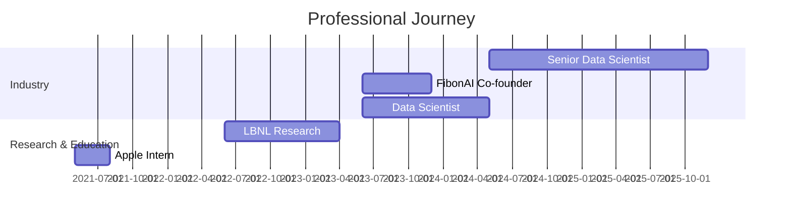

<div align="center">

# 👋 Hey, I'm Abel Yagubyan

### Senior Data Scientist @ C3.ai | Deep Learning & HPC Enthusiast

[](https://abelo9996.github.io)
[](https://linkedin.com/in/abelyagubyan)
[](mailto:abelyagubyan@gmail.com)

</div>

---

## 🚀 About Me

```python
class AbelYagubyan:
    def __init__(self):
        self.current_role = "Senior Data Scientist @ C3.ai"
        self.location = "San Francisco Bay Area"
        self.education = {
            "masters": "M.S. Computer Science @ Northwestern (Summa Cum Laude)",
            "bachelors": "B.A. Computer Science & Applied Math @ UC Berkeley"
        }
        self.interests = [
            "Deep Learning",
            "Predictive Maintenance", 
            "Generative AI",
            "High-Performance Computing"
        ]
    
    def achievements(self):
        return {
            "role": "Senior Data Scientist",
            "startup": "FibonAI Co-founder (UC Berkeley Skydeck)",
            "research": "Lawrence Berkeley National Lab",
            "publications": "ACM SIGCSE '22",
            "education": "M.S. CS Summa Cum Laude"
        }
```

---

## 💻 Tech Stack

### Languages


### AI/ML & Deep Learning


### Frameworks & Tools


### Cloud & Databases


### HPC & Parallel Computing


---

## 🏆 Highlights

<table>
  <tr>
    <td align="center" width="50%">
      
      <br />
      <b>M.S. Computer Science</b>
      <br />
      <sub>Northwestern University</sub>
    </td>
    <td align="center" width="50%">
      
      <br />
      <b>Startup Co-founder</b>
      <br />
      <sub>UC Berkeley Skydeck Pad-13</sub>
    </td>
  </tr>
  <tr>
    <td align="center" width="50%">
      
      <br />
      <b>Research Contributor</b>
      <br />
      <sub>Lawrence Berkeley National Lab</sub>
    </td>
    <td align="center" width="50%">
      
      <br />
      <b>Published Researcher</b>
      <br />
      <sub>Computer Science Education</sub>
    </td>
  </tr>
</table>

---

## 🔬 Featured Projects

<div align="center">

### 🎯 [SCALPEL - DNN Compression Framework](https://github.com/Abelo9996)
> Custom deep neural network compression achieving **80% model size reduction** and **3.5x speedup**  
> `PyTorch` `Python` `AlexNet` `LeNet-5`

### 🖥️ [UPC++ Performance Benchmarking](https://github.com/Abelo9996)
> High-performance computing research at **Lawrence Berkeley National Lab**  
> `C++` `UPC++` `HPC` `Parallel Computing`

### 📝 [RISC-V Compiler for PrairieLearn](https://github.com/Abelo9996)
> Interactive IDE integrated into online testing platform for **3,000+ students**  
> `JavaScript` `C` `RISC-V` `Education`

### 🎵 [Real-Time Music Classification](https://github.com/Abelo9996)
> Spectrogram-based CNN for genre classification with **87% accuracy**  
> `TensorFlow` `CNN` `Audio Processing`

</div>

---

## 📊 GitHub Activity

<div align="center">

[](https://github.com/Abelo9996)

</div>

---

## 🌟 Experience Timeline



---

## 📫 Let's Connect

I'm always interested in collaborating on:
- 🤖 Deep Learning & AI applications
- ⚡ High-performance computing solutions
- 🔧 Machine learning research
- 💡 Innovative tech startups

<div align="center">

### 📧 [abelyagubyan@gmail.com](mailto:abelyagubyan@gmail.com)

**🌐 [Visit my portfolio](https://abelo9996.github.io) to learn more about my work!**

---

*"Building intelligent systems that make a real-world impact"*

</div>
